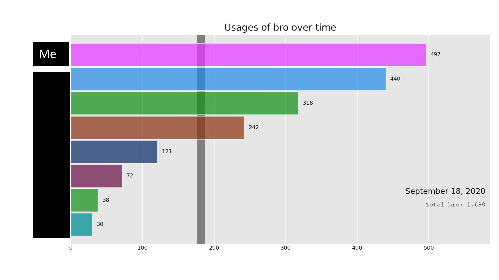
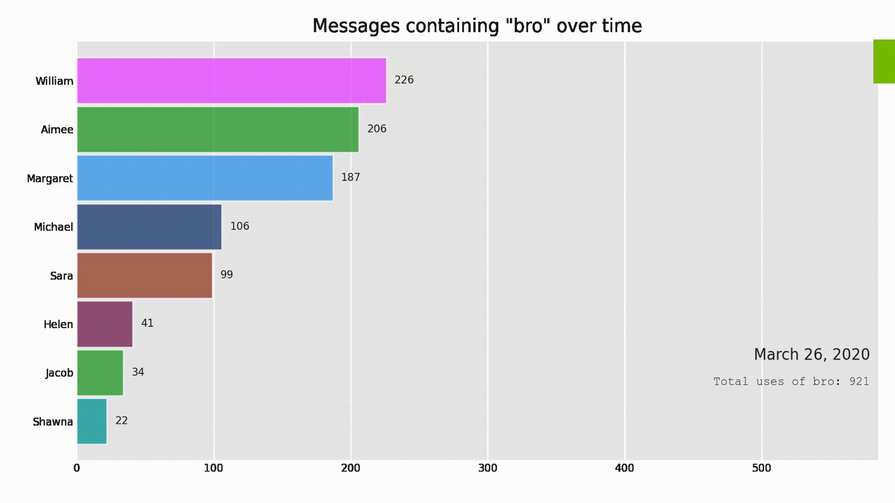

# BroGraph

  

---

## Intro
During the lockdowns of 2020, the frequency of messages in my Discord spiked and with it, the use of "bro", particularly "bro..."

It caught on like a bug.

I wanted to know who was the perpetrator of these "bro"s.

Thus this notebook was borne.

**This notebook generates a video of the usages of that word over time**

## Installation

1. Download [DiscordChatExporter](https://github.com/Tyrrrz/DiscordChatExporter)
2. Export the `[channelName].json` file with the above program and place in root folder
3. `pip install -r requirements` (Makes use of Python Package bar_chart_race)
4. Have [ffmpeg](https://www.ffmpeg.org/)
5. Run the notebook and fill in variables for the word to track and the `[channelName].json` generated from the exporter

## Media
Names anonymised in gif

  
  

